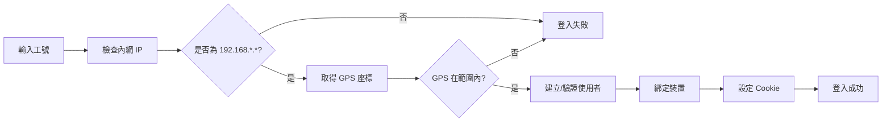
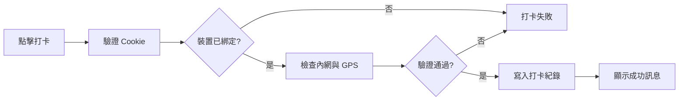

# 員工打卡系統 (Employee Clock-in System)

一個基於 Node.js + Express + MongoDB 的員工打卡系統，支援裝置綁定、公司 Wi-Fi 驗證、GPS 範圍檢查等功能。

## ✨ 主要功能

- 🔐 **裝置綁定**：每位員工僅能在已綁定的裝置上打卡
- 📡 **Wi-Fi 驗證**：檢查是否連線至公司內網 (192.168.*.*)
- 📍 **GPS 定位**：驗證打卡位置是否在公司範圍內
- 📊 **打卡紀錄**：完整記錄員工打卡時間與位置資訊
- 🔒 **HTTPS 加密**：使用本地 HTTPS 憑證確保資料傳輸安全

## 🚀 快速啟動

### 前置需求

- Node.js (建議 v14 以上)
- MongoDB
- npm 或 yarn

### 安裝步驟

1. **Clone 專案**
```bash
git clone https://github.com/yourusername/clock-in-system.git
cd clock-in-system
```

2. **安裝相依套件**
```bash
npm install
```

3. **環境變數設定**

建立 `.env` 檔案並設定以下變數：
```env
MONGODB_URI=mongodb://localhost:27017/clockin
COMPANY_LAT=25.0330    # 公司緯度
COMPANY_LNG=121.5654   # 公司經度
PORT=3000
```

4. **啟動服務**

開發模式：
```bash
npm run dev
```

正式環境：
```bash
npm start
```

5. **開啟瀏覽器**

訪問 `https://localhost:3000`

> ⚠️ **注意**：因使用自簽憑證，瀏覽器會顯示安全性警告，請點擊「繼續前往」。

## 📁 專案結構
```
clock-in-system/
├── config/
│   └── db.js                 # MongoDB 連線設定
├── controllers/
│   ├── auth.controller.js    # 登入邏輯
│   ├── record.controller.js  # 打卡邏輯
│   └── home.controller.js    # 首頁邏輯
├── models/
│   ├── user.model.js         # 使用者資料模型
│   └── record.model.js       # 打卡紀錄模型
├── routes/
│   ├── auth.routes.js        # 登入路由
│   ├── record.routes.js      # 打卡路由
│   └── home.routes.js        # 首頁路由
├── services/
│   ├── user.service.js       # 使用者服務
│   └── record.service.js     # 打卡服務
├── utils/
│   └── location.js           # GPS 距離計算
├── views/
│   ├── layouts/
│   │   └── layout.ejs        # 主要版面
│   ├── pages/
│   │   └── index.ejs         # 首頁
│   └── partials/
│       ├── loginForm.ejs     # 登入表單
│       ├── clockinForm.ejs   # 打卡表單
│       └── message.ejs       # 訊息顯示
├── public/
│   └── js/
│       └── location.js       # 前端 GPS 定位
├── server.js                 # 伺服器啟動檔
├── .env                      # 環境變數 (需自行建立)
├── localhost.pem             # HTTPS 憑證
├── localhost-key.pem         # HTTPS 私鑰
└── package.json
```

## 🔄 運作流程

### 1. 登入流程


### 2. 打卡流程


## 🛠️ 技術棧

- **後端框架**：Express.js
- **資料庫**：MongoDB + Mongoose
- **模板引擎**：EJS
- **安全性**：HTTPS、Cookie (httpOnly)
- **前端**：原生 JavaScript (Geolocation API)

## ⚙️ 主要配置

### GPS 範圍設定

在 `utils/location.js` 中調整允許的打卡範圍（單位：度）：
```javascript
const DISTANCE_THRESHOLD = 0.01; // 約 1 公里
```

### 內網 IP 驗證

系統預設檢查 IP 是否為 `192.168.*.*`，可在 `controllers/auth.controller.js` 中修改：
```javascript
const isCompanyNetwork = (ip) => {
  return ip.startsWith('192.168.');
};
```

## 📝 API 端點

| 方法 | 路徑 | 說明 |
|------|------|------|
| GET | `/` | 首頁 |
| POST | `/login` | 員工登入 |
| POST | `/clockin` | 打卡 |

## 🔧 開發指令
```bash
# 開發模式 (熱重載)
npm run dev

# 正式啟動
npm start

# 安裝相依套件
npm install
```

## ⚠️ 注意事項

1. **GPS 精度**：目前使用簡單的座標距離計算，如需更精確的距離判斷，建議改用 Haversine 公式。

2. **HTTPS 憑證**：專案包含的憑證僅供開發測試使用，正式環境請使用有效的 SSL 憑證。

3. **Cookie 安全**：
   - `employeeId`：用於識別使用者
   - `deviceHash`：用於裝置綁定驗證（設定為 httpOnly）

4. **瀏覽器相容性**：需支援 Geolocation API 的現代瀏覽器。

**⭐ 如果這個專案對你有幫助，請給個星星支持一下！**
